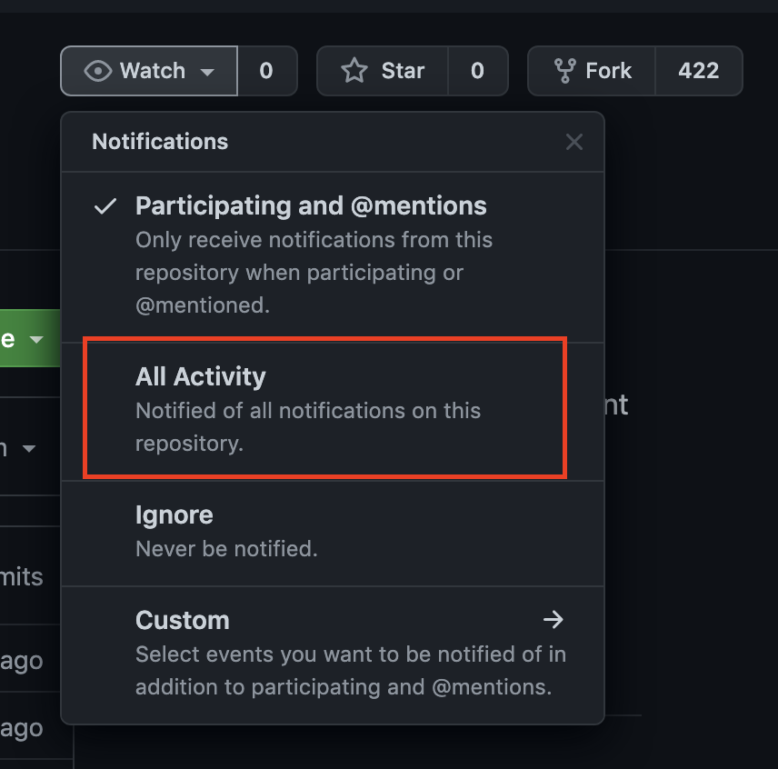

# Algo-practice-questions with answers JS
Algorithm practice questions with answers in Javascript. These algorithms are divided into different data structures:
- Array, strings and numbers
- Linked List (SLL & DLL)
- Binary Search Trees
- Least Recently Used Cache
- Heaps

The algorithms have been broken down into different levels of complexities; beginner, intermediate and advanced. 

> NOTE: Change the `Watch` icon option on this repo to `All Activity` to receive notifications when more questions are added in the future.

